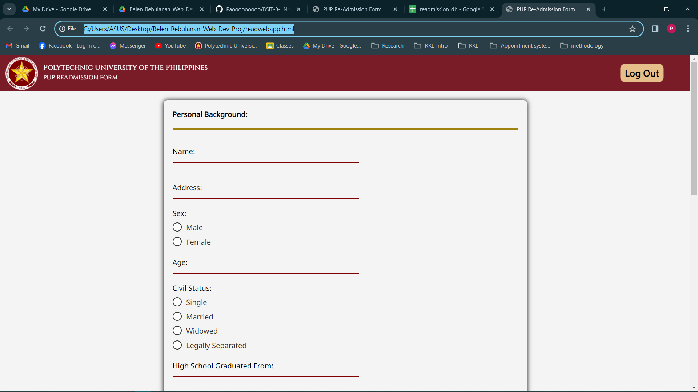

# User Guide

Follow these steps to navigate through the application:

1. **Sign In:**
   - Go to the Homepage.
   - Click on **Sign In** to access the login page.

   

2. **Log In:**
   - Enter any credentials.
     - Student Number: *any number*
     - Password: *just input something*
   - Click **Log In** to access the readmission webpage.

   

3. **Input Data:**
   - Fill in the required fields on the readmission webpage.

   

4. **Submit Data:**
   - Click **Submit** to store your data in the database.

   

5. **Log Out:**
   - Return to the Homepage by clicking **Log Out**.

   

Follow these steps carefully to ensure a smooth user experience.
